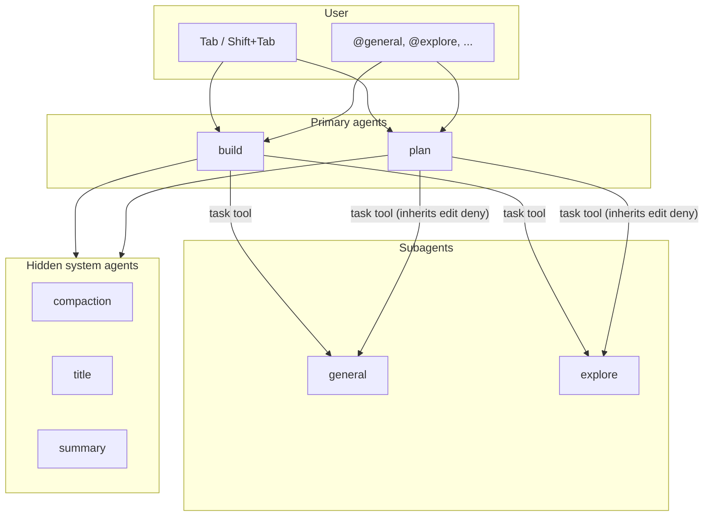
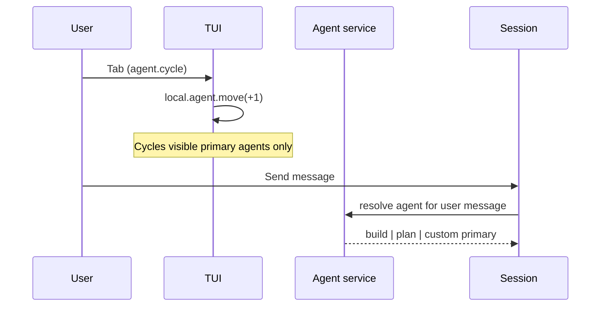
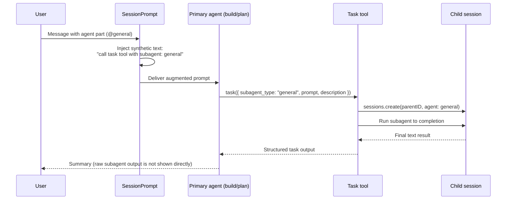
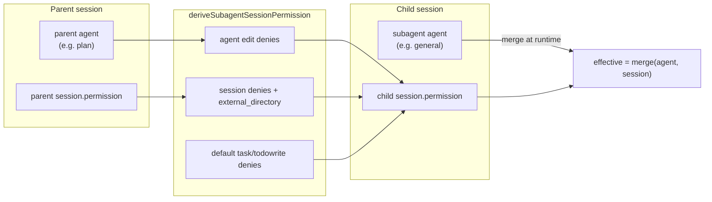

# Agent Architecture

This document explains how OpenCode agents work at the implementation level: what
an agent is, how built-in agents differ, how primary and subagent modes interact,
and how permissions flow through parent and child sessions.

For user-facing configuration reference, see [packages/web/src/content/docs/agents.mdx](packages/web/src/content/docs/agents.mdx) (published at [opencode.ai/docs/agents](https://opencode.ai/docs/agents)).

---

## Mental model

An agent is **not** a separate AI model. It is a **named profile** that bundles:

| Field | Role |
|-------|------|
| **Permissions** | Which tools may run, and whether each action is `allow`, `ask`, or `deny` |
| **Mode** | How the agent is exposed: `primary` (user-selectable), `subagent` (delegated), or `all` |
| **Description / prompt** | Instructions for the model and hints for when to delegate |
| **Model** | Optional per-agent model override |
| **Options** | Provider-specific parameters passed through to the LLM |

The same underlying model runs regardless of agent. Switching agents changes tool
access, system context, and delegation behavior — not the provider connection itself.

---

## Where agents are defined

Built-in agents are registered in `packages/opencode/src/agent/agent.ts` when the
Agent service initializes. User config from `opencode.json` and markdown agent
files merges on top of these defaults.

A parallel V2 registration exists in `packages/core/src/plugin/agent.ts` for the
Session V2 event system. The built-in set and permission intent match between the
two layers.

```text
Config (opencode.json, .opencode/agents/*.md)
        │
        ▼ merge
Built-in defaults (agent.ts)
        │
        ▼
Agent.Info { name, mode, permission, prompt, model, ... }
        │
        ├──► Primary session (user talks here)
        └──► Task tool spawns child sessions (subagents)
```

---

## Agent modes

| Mode | User can select (Tab) | Appears in `@` menu | Invoked via Task tool |
|------|----------------------|---------------------|----------------------|
| `primary` | Yes (if not `hidden`) | No | No |
| `subagent` | No | Yes (if not `hidden`) | Yes |
| `all` | Yes | Yes | Yes |

The TUI filters selectable agents to non-subagent, non-hidden entries:

```ts
// packages/tui/src/context/local.tsx
sync.data.agent.filter((x) => x.mode !== "subagent" && !x.hidden)
```

Tab cycles through that list (`agent.cycle` → Tab, `agent.cycle.reverse` → Shift+Tab).

---

## Built-in agents

### User-facing

| Agent | Mode | Purpose |
|-------|------|---------|
| **build** | `primary` | Default development agent. Full tool access subject to global permission rules. |
| **plan** | `primary` | Analysis and planning. Denies file edits except plan documents. |
| **general** | `subagent` | Multi-step and parallel work. Full tools except `todowrite`. |
| **explore** | `subagent` | Fast read-only codebase search (grep, glob, read, webfetch, websearch). |

### System (hidden)

| Agent | Mode | Purpose |
|-------|------|---------|
| **compaction** | `primary` | Summarizes long context automatically. |
| **title** | `primary` | Generates session titles. |
| **summary** | `primary` | Generates session summaries. |

`build` is the default when `default_agent` is unset. Config may override or
disable any built-in via `agent: { <name>: { disable: true } }`.

**Note:** `packages/web/src/content/docs/agents.mdx` documents a **scout**
subagent for external dependency research. As of this writing, `scout` is not
registered in `packages/opencode/src/agent/agent.ts`. Treat scout as
documentation-ahead-of-implementation unless a plugin or config entry adds it.

---

## Default permission baselines

All agents start from a shared default ruleset, then merge agent-specific and
user-configured rules.

### Shared defaults (all agents)

| Permission | Default | Notes |
|------------|---------|-------|
| `*` (wildcard tools) | `allow` | Covers bash and most tools |
| `doom_loop` | `ask` | Repeated identical tool calls |
| `external_directory` | `ask` | Paths outside the workspace (whitelisted dirs excepted) |
| `read` | `allow` | `*.env` and `*.env.*` are `ask`; `*.env.example` is `allow` |
| `question` | `deny` | User-facing question tool |
| `plan_enter` | `deny` | Switch into plan mode |
| `plan_exit` | `deny` | Switch out of plan mode |

### build additions

| Permission | Effect |
|------------|--------|
| `question` | `allow` |
| `plan_enter` | `allow` |

### plan additions

| Permission | Effect |
|------------|--------|
| `question` | `allow` |
| `plan_exit` | `allow` |
| `edit` `*` | `deny` |
| `edit` `.opencode/plans/*.md` | `allow` |
| `edit` `<data>/plans/*.md` (relative to worktree) | `allow` |
| `external_directory` `<data>/plans/*` | `allow` |

Plan does **not** override `bash` in the built-in config. Bash inherits the
shared default (`allow`). User docs sometimes describe plan as asking before
bash; that behavior requires an explicit config override, e.g.
`agent.plan.permission.bash: "ask"`.

### general additions

| Permission | Effect |
|------------|--------|
| `todowrite` | `deny` |

### explore additions

Denies `*` then explicitly allows: `grep`, `glob`, `list`, `bash`, `webfetch`,
`websearch`, `read`, plus read-only `external_directory` rules.

Effective tool permissions are evaluated as
`Permission.merge(agent.permission, session.permission)` at runtime.

---

## High-level architecture



---

## Runtime flows

### 1. Primary agent selection (Tab)



Agent switches are recorded as `agent-switched` messages in the session timeline.

### 2. Manual subagent invocation (`@general`)

Typing `@general` in the prompt does **not** directly run the subagent. The flow
is:



Relevant code:

- `@` autocomplete creates an `agent` part: `packages/opencode/src/cli/cmd/run/footer.prompt.tsx`
- Synthetic delegation instruction: `packages/opencode/src/session/prompt.ts` (~line 957)
- Child session creation: `packages/opencode/src/tool/task.ts`

User `@` invocation bypasses `permission.task` deny rules on the primary agent.
The synthetic hint appends `"Invoked by user; guaranteed to exist."` when task
permission would otherwise deny the subagent.

### 3. Automatic subagent delegation (Task tool)

Primary agents can call the `task` tool without an `@` mention when their
description and the Task tool instructions indicate a subagent is appropriate.
The model chooses `subagent_type` (e.g. `explore` for fast codebase search).

Before spawning, the primary agent may need `permission.task` approval for the
target subagent name (unless bypassed by user `@` invocation).

Each task invocation creates (or resumes) a **child session** linked via
`parentID`. Child session titles follow the pattern
`"<description> (@<agent> subagent)"`.

Subagents cannot spawn nested subagents by default: child sessions deny the
`task` tool unless the subagent's own permission rules explicitly allow it.

---

## Child session navigation

When subagents run, the TUI exposes parent/child session navigation:

| Keybind | Default | Action |
|---------|---------|--------|
| `session_child_first` | Leader+Down | Enter first child session |
| `session_child_cycle` | Right | Next child session |
| `session_child_cycle_reverse` | Left | Previous child session |
| `session_parent` | Up | Return to parent session |

Defined in `packages/tui/src/config/keybind.ts`.

Background subagent execution (`background: true` on the task tool) requires
`OPENCODE_EXPERIMENTAL_BACKGROUND_SUBAGENTS=true`.

---

## Permission inheritance (plan → subagent)

Plan mode restrictions live on the **agent** ruleset, not on the parent session's
`permission` field. Without special handling, a subagent spawned from plan would
inherit only session-level rules and could bypass edit restrictions.

`deriveSubagentSessionPermission` in
`packages/opencode/src/agent/subagent-permissions.ts` fixes this by forwarding:

1. Parent **agent** `edit` deny rules (plan mode protection)
2. Parent **session** deny rules and `external_directory` rules
3. Default `todowrite` and `task` denies for the child (unless the subagent
   explicitly permits them)



Regression coverage: `packages/opencode/test/agent/plan-mode-subagent-bypass.test.ts`.

---

## Plan ↔ build transitions

Plan and build can switch modes programmatically via dedicated tools:

| Tool | Available on | Behavior |
|------|--------------|----------|
| `plan_enter` | build | Enter plan mode |
| `plan_exit` | plan | Offer to switch to build and begin implementation |

`plan_exit` can prompt the user, then synthesize a user message that switches
the session agent to `build`. See `packages/opencode/src/tool/plan.ts`.

---

## Configuration

Agents are customized through:

| Source | Location |
|--------|----------|
| JSON config | `opencode.json` → `"agent": { ... }` |
| Project markdown | `.opencode/agents/<name>.md` or `.opencode/agent/<name>.md` |
| Global markdown | `~/.config/opencode/agents/<name>.md` |

Config entries merge onto built-in defaults. Unknown custom agents default to
`mode: "all"` with merged default permissions.

Key config fields: `description`, `mode`, `model`, `prompt`, `permission`,
`hidden`, `color`, `steps`, `temperature`, `disable`.

`default_agent` must reference a non-hidden `primary` (or `all`) agent.

`permission.task` controls which subagent names a primary agent may invoke via
the Task tool (glob patterns; last match wins). User `@` mentions are not
blocked by `permission.task` deny rules.

See also `packages/core/src/plugin/skill/customize-opencode.md` for a concise
config reference aimed at customization workflows.

---

## Key source files

| Area | Path |
|------|------|
| Built-in agent registry | `packages/opencode/src/agent/agent.ts` |
| V2 agent plugin registration | `packages/core/src/plugin/agent.ts` |
| V2 agent state / selection | `packages/core/src/agent.ts` |
| Subagent session permissions | `packages/opencode/src/agent/subagent-permissions.ts` |
| Task tool (subagent spawn) | `packages/opencode/src/tool/task.ts` |
| `@` mention → synthetic delegation | `packages/opencode/src/session/prompt.ts` |
| Plan exit / build switch | `packages/opencode/src/tool/plan.ts` |
| TUI agent cycling | `packages/tui/src/context/local.tsx` |
| TUI keybinds | `packages/tui/src/config/keybind.ts` |
| Agent config schema | `packages/core/src/config/agent.ts` |
| Permission tests | `packages/opencode/test/agent/agent.test.ts` |
| Plan subagent bypass test | `packages/opencode/test/agent/plan-mode-subagent-bypass.test.ts` |

---

## Related documentation (and known gaps)

| Document | Scope |
|----------|-------|
| [agents.mdx](packages/web/src/content/docs/agents.mdx) | User guide: usage, configuration, examples |
| [permissions.mdx](packages/web/src/content/docs/permissions.mdx) | Permission rule format and evaluation |
| [README.md](README.md) | Short build/plan/`@general` summary |

Gaps this architecture doc fills that user docs do not:

- Agents as permission profiles, not separate models
- `@mention` → synthetic prompt → Task tool → child session pipeline
- Parent/child permission inheritance (especially plan → subagent)
- Built-in permission truth table vs marketing copy
- `scout` documented but not implemented in the built-in registry

When user docs and this file disagree on built-in behavior, **trust the source
files listed above** and file a docs fix separately.
