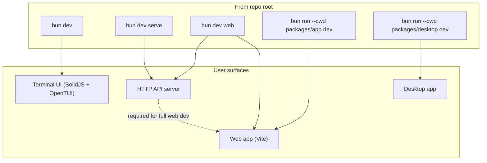

# Running OpenCode Locally

How to run OpenCode from this repository during development. This is distinct from
installing the published `opencode-ai` package or the desktop app from releases.

For contribution workflow and PR expectations, see [CONTRIBUTING.md](CONTRIBUTING.md).

---

## Prerequisites

| Requirement | Notes |
|-------------|-------|
| **Bun 1.3+** | Repo pins `bun@1.3.14` in [package.json](package.json). Check with `bun --version`. |
| **Git** | Clone this repo and work on branch `dev` (default). |
| **Provider credentials** | Configure API keys or OAuth for your LLM provider (see [docs](https://opencode.ai/docs)). |

First-time setup from the repo root:

```bash
cd /path/to/opencode
bun install
```

`postinstall` runs `packages/core` setup (e.g. `node-pty` fix). Allow it to finish.

---

## Quick start (TUI)

The default dev entrypoint is the **terminal UI** (TUI):

```bash
bun dev
```

Root `package.json` runs:

```bash
bun run --cwd packages/opencode --conditions=browser src/index.ts
```

That is the same CLI surface as production `opencode`, but executed from source.

### Which directory does it open?

| Command | Working directory |
|---------|-------------------|
| `bun dev` | `packages/opencode/` (package default cwd) |
| `bun dev .` | Current directory (e.g. the opencode repo root) |
| `bun dev /path/to/project` | Absolute or relative project path |

To hack on OpenCode itself:

```bash
bun dev .
```

---

## `bun dev` vs `opencode`

During development, treat `bun dev` as a drop-in for the installed binary:

| Task | Development | Production |
|------|-------------|------------|
| Help | `bun dev --help` | `opencode --help` |
| TUI (default) | `bun dev [project]` | `opencode [project]` |
| Headless API server | `bun dev serve` | `opencode serve` |
| Server + open web UI | `bun dev web` | `opencode web` |
| Attach TUI to server | `bun dev attach http://localhost:4096` | `opencode attach http://localhost:4096` |
| Non-interactive run | `bun dev run "prompt"` | `opencode run "prompt"` |

Global CLI flags (available on all commands):

- `--print-logs` — log to stderr
- `--log-level DEBUG|INFO|WARN|ERROR`
- `--pure` — run without external plugins

---

## Run modes



### 1. Terminal UI (most common)

```bash
bun dev
bun dev .
bun dev --continue          # resume last session
bun dev --session <id>      # resume specific session
bun dev --model provider/model
```

Implementation: `packages/opencode/src/cli/cmd/tui.ts` + `packages/tui/`.

The TUI runs the server in a **worker thread** (`packages/opencode/src/cli/tui/worker.ts`). That keeps the UI responsive but can complicate debugging (see [Debugging](#debugging)).

**tmux tip** (from `packages/opencode/AGENTS.md`): when you need to inspect TUI output without blocking your shell:

```bash
tmux new-session -d -s opencode-dev 'bun dev'
tmux capture-pane -pt opencode-dev
tmux kill-session -t opencode-dev
```

### 2. Headless API server

```bash
bun dev serve
bun dev serve --port 8080
bun dev serve --hostname 0.0.0.0 --mdns
```

- Default port: **4096** when available (`port 0` resolves to 4096; see server listen tests).
- Server loads project context per request via the `x-opencode-directory` header.
- Without `OPENCODE_SERVER_PASSWORD`, the server logs an **unsecured** warning.

Attach a TUI to a running server:

```bash
# Terminal 1
bun dev serve

# Terminal 2
bun dev attach http://localhost:4096
```

### 3. Web app

`bun dev web` starts the server and opens a browser. For **local UI development**, run backend and frontend separately — `opencode web` / `bun dev web` may proxy production assets and won't show your `packages/app` changes.

**Recommended web dev setup:**

```bash
# Terminal 1 — backend
bun run --cwd packages/opencode --conditions=browser ./src/index.ts serve --port 4096

# Terminal 2 — frontend
bun run --cwd packages/app dev -- --port 4444
```

Open http://localhost:4444 (app targets backend at http://localhost:4096).

From repo root you can also use:

```bash
bun dev serve          # if not already on 4096
bun dev:web            # alias for packages/app dev
```

E2E tests (`packages/app`): backend at `localhost:4096`, Playwright drives Vite on port 3000 by default.

### 4. Desktop app (Electron)

```bash
bun run --cwd packages/desktop dev
```

Build and package:

```bash
bun run --cwd packages/desktop build
bun run --cwd packages/desktop package
```

Or from root: `bun dev:desktop`.

### 5. Other dev surfaces

| Script | Command | Purpose |
|--------|---------|---------|
| Console | `bun dev:console` | Console web app (`packages/console/app`) |
| Stats | `bun dev:stats` | Stats site (requires SST shell) |
| Storybook | `bun dev:storybook` | UI component stories |
| Docs site | `bun run --cwd packages/web dev` | Astro docs at localhost:4321 |

---

## Building a local binary

Compile a standalone executable (not required for day-to-day dev):

```bash
./packages/opencode/script/build.ts --single
```

Run the result:

```bash
./packages/opencode/dist/opencode-<platform>/bin/opencode
```

Replace `<platform>` with your target (e.g. `darwin-arm64`, `linux-x64`).

---

## Monorepo map

| Package | Path | Role |
|---------|------|------|
| **opencode** | `packages/opencode` | Core CLI, server, session logic, tools |
| **tui** | `packages/tui` | Terminal UI components |
| **app** | `packages/app` | Shared web UI (SolidJS) |
| **desktop** | `packages/desktop` | Electron wrapper |
| **core** | `packages/core` | Shared types, DB schema, V2 session core |
| **sdk** | `packages/sdk/js` | Generated JS SDK |
| **plugin** | `packages/plugin` | `@opencode-ai/plugin` |
| **web** | `packages/web` | Documentation site (Astro) |

Entry point for the CLI: `packages/opencode/src/index.ts`.

---

## After changing APIs

If you modify server routes or OpenAPI shapes (e.g. `packages/opencode/src/server/`):

```bash
./script/generate.ts
# or, for the JS SDK specifically:
./packages/sdk/js/script/build.ts
```

---

## Typecheck and tests

**Do not run tests from the repo root** (guard in root `package.json`).

```bash
# Typecheck (from package dir, not tsc directly)
bun run --cwd packages/opencode typecheck
bun run --cwd packages/core typecheck

# Tests
bun run --cwd packages/opencode test
bun run --cwd packages/core test
```

Root `bun typecheck` runs Turbo across packages.

---

## Debugging

Bun debugging can mis-map breakpoints when the server runs inside the TUI worker thread.

**Reliable approach — split server and TUI:**

```bash
# Terminal 1: debug server
bun run --inspect=ws://localhost:6499/ --cwd packages/opencode ./src/index.ts serve --port 4096

# Terminal 2: attach TUI
bun dev attach http://localhost:4096
```

**TUI-only debugging:**

```bash
bun run --inspect=ws://localhost:6499/ --cwd packages/opencode --conditions=browser ./src/index.ts
```

Tips:

- Use `--inspect-wait` or `--inspect-brk` to pause on start.
- `export BUN_OPTIONS=--inspect=ws://localhost:6499/` avoids repeating the flag.
- VSCode examples: [.vscode/launch.example.json](.vscode/launch.example.json), [.vscode/settings.example.json](.vscode/settings.example.json).

> **Note:** [CONTRIBUTING.md](CONTRIBUTING.md) mentions `bun dev spawn` for debugging. That subcommand is not registered in the current CLI (`packages/opencode/src/index.ts`). Prefer the server + `attach` workflow above.

---

## Common issues

| Problem | Fix |
|---------|-----|
| `bun: command not found` or version &lt; 1.3 | Install/upgrade Bun: https://bun.sh |
| Missing modules | Run `bun install` from repo root |
| Web UI changes not visible | Use separate `serve` + `packages/app dev`, not `bun dev web` alone |
| Port already in use | `bun dev serve --port <other>` and point app/attach at that port |
| Breakpoints don't hit in TUI | Debug server separately; attach with `bun dev attach` |
| Provider/auth errors | Run `bun dev providers` or configure credentials per [docs](https://opencode.ai/docs) |

---

## Related docs

| Doc | Contents |
|-----|----------|
| [CONTRIBUTING.md](CONTRIBUTING.md) | Full dev guide, debugging, PR policy |
| [AGENT_ARCHITECTURE.md](AGENT_ARCHITECTURE.md) | How build/plan/subagents work |
| [AGENTS.md](AGENTS.md) | Code style and V2 session rules |
| [packages/app/AGENTS.md](packages/app/AGENTS.md) | Web UI local dev specifics |
| [README.md](README.md) | Installation for end users (not from source) |
