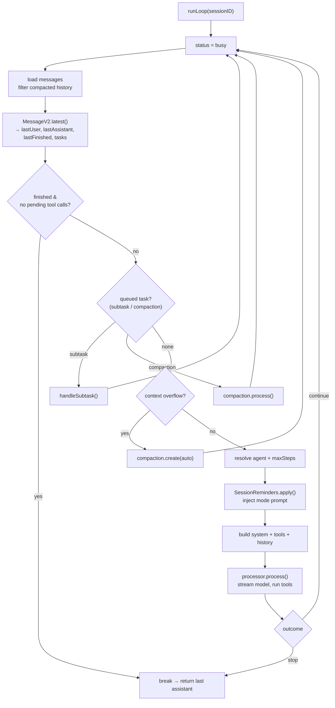

# Run Loop Architecture

How OpenCode turns a single user prompt into a sequence of model turns and tool
executions, when it stops, and how "understand-before-acting" behavior (plan
mode, clarifying questions) is layered on top.

This complements [AGENT_ARCHITECTURE.md](AGENT_ARCHITECTURE.md), which covers
*which* agent runs. This doc covers *how* a turn runs.

---

## TL;DR

There is no proprietary reasoning engine. The "agent loop" is a plain
**model → tools → feed results back → repeat until stop** loop. The intelligence
comes from what is injected into each turn (system prompts, mode reminders,
tools, permissions), not from the loop structure.

The closest thing to a "chain of reasoning that acquires user needs first" is
**plan mode**, which is a prompt-encoded 5-phase workflow plus permission gating,
not loop logic.

---

## Key source files

| Concern | Path |
|---------|------|
| Outer loop (`runLoop`) | `packages/opencode/src/session/prompt.ts` |
| Per-turn streaming + tool exec | `packages/opencode/src/session/processor.ts` |
| Run coordination (one run per session) | `packages/opencode/src/session/run-state.ts` |
| Mode reminder injection | `packages/opencode/src/session/reminders.ts` |
| Base system prompt | `packages/opencode/src/session/prompt/default.txt` |
| Plan mode workflow prompt | `packages/opencode/src/session/prompt/plan-mode.txt` |
| Build switch reminder | `packages/opencode/src/session/prompt/build-switch.txt` |
| Max-steps cutoff prompt | `packages/opencode/src/session/prompt/max-steps.txt` |
| Clarify tool | `packages/opencode/src/tool/question.ts` |
| Plan exit / build handoff | `packages/opencode/src/tool/plan.ts` |

---

## Entry: prompt → loop

`SessionPrompt.prompt` admits the user message, optionally applies per-call tool
permissions, then enters the loop unless `noReply` is set:

```1105:1124:packages/opencode/src/session/prompt.ts
    const prompt: (input: PromptInput) => Effect.Effect<SessionV1.WithParts, Image.Error> = Effect.fn(
      "SessionPrompt.prompt",
    )(function* (input: PromptInput) {
      const session = yield* sessions.get(input.sessionID).pipe(Effect.orDie)
      yield* revert.cleanup(session)
      const message = yield* createUserMessage(input)
      yield* sessions.touch(input.sessionID)
      ...
      if (input.noReply === true) return message
      return yield* loop({ sessionID: input.sessionID })
    })
```

`loop` wraps `runLoop` in run coordination so a session has a single active run;
concurrent prompts join or coalesce instead of double-running:

```1392:1396:packages/opencode/src/session/prompt.ts
    const loop: (input: LoopInput) => Effect.Effect<SessionV1.WithParts> = Effect.fn("SessionPrompt.loop")(function* (
      input: LoopInput,
    ) {
      return yield* state.ensureRunning(input.sessionID, lastAssistant(input.sessionID), runLoop(input.sessionID))
    })
```

---

## The outer loop (`runLoop`)

`runLoop` is a `while (true)` over **steps**. Each iteration is one assistant
turn (one provider call plus any tool executions it triggers).



### Step bookkeeping

The loop reloads projected history each iteration (durable, not in-memory), then
derives the latest state:

```1145:1151:packages/opencode/src/session/prompt.ts
          let msgs = yield* MessageV2.filterCompactedEffect(sessionID).pipe(
            Effect.provideService(Database.Service, database),
          )

          const { user: lastUser, assistant: lastAssistant, finished: lastFinished, tasks } = MessageV2.latest(msgs)

          if (!lastUser) throw new Error("No user message found in stream. This should never happen.")
```

### Stop condition

The loop breaks when the last assistant message finished with a non-`tool-calls`
reason **and** there are no pending tool calls to feed back:

```1164:1183:packages/opencode/src/session/prompt.ts
          if (
            lastAssistant?.finish &&
            !["tool-calls"].includes(lastAssistant.finish) &&
            !hasToolCalls &&
            lastUser.id < lastAssistant.id
          ) {
            ...
            yield* Effect.logInfo("exiting loop", { "session.id": sessionID })
            break
          }
```

Some providers report `stop` even when the message contains tool calls, so the
loop explicitly keeps going while unresolved tool calls exist:

```1156:1162:packages/opencode/src/session/prompt.ts
          // Some providers return "stop" even when the assistant message contains
          // tool calls. Keep the loop running so tool results can be sent back to
          // the model, but ignore cleanup-marked interrupted orphans.
          const hasToolCalls =
            lastAssistantMsg?.parts.some(
              (part) => part.type === "tool" && !part.metadata?.providerExecuted && !isOrphanedInterruptedTool(part),
            ) ?? false
```

### Side work on step 1

On the first step the loop forks (non-blocking) title generation and a session
summary:

```1185:1192:packages/opencode/src/session/prompt.ts
          step++
          if (step === 1)
            yield* title({
              session,
              modelID: lastUser.model.modelID,
              providerID: lastUser.model.providerID,
              history: msgs,
            }).pipe(Effect.ignore, Effect.forkIn(scope))
```

---

## Per-turn assembly

Before each provider call the loop resolves the agent, applies mode reminders,
and assembles system context + tools + history.

### Agent + max steps

```1223:1232:packages/opencode/src/session/prompt.ts
          const agent = yield* agents.get(lastUser.agent)
          if (!agent) {
            ...
          }
          const maxSteps = agent.steps ?? Infinity
          const isLastStep = step >= maxSteps
```

When `isLastStep`, an assistant-role `MAX_STEPS` message is appended that
disables tools and forces a text-only wrap-up:

```1343:1343:packages/opencode/src/session/prompt.ts
              messages: [...modelMsgs, ...(isLastStep ? [{ role: "assistant" as const, content: MAX_STEPS }] : [])],
```

(`MAX_STEPS` text: `packages/opencode/src/session/prompt/max-steps.txt`.)

### Mode reminder injection

`SessionReminders.apply` mutates the latest user message with synthetic,
mode-specific instructions — this is where plan mode, build-switch, and
"execute the plan" guidance enter context:

```1233:1237:packages/opencode/src/session/prompt.ts
          msgs = yield* SessionReminders.apply({ messages: msgs, agent, session }).pipe(
            Effect.provideService(RuntimeFlags.Service, flags),
            Effect.provideService(FSUtil.Service, fsys),
            Effect.provideService(Session.Service, sessions),
          )
```

### System context + tools

```1327:1335:packages/opencode/src/session/prompt.ts
            const [skills, env, instructions, modelMsgs] = yield* Effect.all([
              sys.skills(agent),
              sys.environment(model),
              instruction.system().pipe(Effect.orDie),
              MessageV2.toModelMessagesEffect(msgs, model),
            ])
            const system = [...env, ...instructions, ...(skills ? [skills] : [])]
```

Tools are resolved per agent/session, so permissions and the active agent
determine the available toolset for the turn.

### Resume-message reminder

If new user messages arrived mid-run (after the last finished assistant), they
are wrapped so the model treats them as steering rather than a fresh task:

```1313:1321:packages/opencode/src/session/prompt.ts
                  p.text = [
                    "<system-reminder>",
                    "The user sent the following message:",
                    p.text,
                    "",
                    "Please address this message and continue with your tasks.",
                    "</system-reminder>",
                  ].join("\n")
```

---

## The inner turn (`processor.process`)

The processor runs exactly one provider stream per turn and reacts to streamed
events (text, reasoning, tool calls, step-finish, finish):

```974:980:packages/opencode/src/session/processor.ts
            const stream = llm.stream(streamInput)

            yield* stream.pipe(
              Stream.tap((event) => handleEvent(event)),
              Stream.takeUntil(() => ctx.needsCompaction),
              Stream.runDrain,
            )
```

It returns one of three results that drive the outer loop:

```36:36:packages/opencode/src/session/processor.ts
export type Result = "compact" | "stop" | "continue"
```

The outer loop maps that result to break/continue/compact:

```1368:1378:packages/opencode/src/session/prompt.ts
            if (result === "stop") return "break" as const
            if (result === "compact") {
              yield* compaction.create({
                sessionID,
                agent: lastUser.agent,
                model: lastUser.model,
                auto: true,
                overflow: !handle.message.finish,
              })
            }
            return "continue" as const
```

### Doom-loop guard

If the model repeats the same action `DOOM_LOOP_THRESHOLD` (3) times, the
`doom_loop` permission is triggered (default `ask`), preventing runaway identical
tool calls:

```35:35:packages/opencode/src/session/processor.ts
const DOOM_LOOP_THRESHOLD = 3
```

### Interruption

Aborting interrupts the stream, marks the assistant message aborted, and
finalizes partial tool calls so the session ends in a consistent state:

```982:988:packages/opencode/src/session/processor.ts
            Effect.onInterrupt(() =>
              Effect.gen(function* () {
                aborted = true
                if (!ctx.assistantMessage.error) {
                  yield* halt(new DOMException("Aborted", "AbortError"))
                }
              }),
            ),
```

### Context overflow → compaction

When a provider reports context overflow, the processor flags compaction (unless
auto-compaction is disabled), and the outer loop creates a compaction pass and
continues:

```926:936:packages/opencode/src/session/processor.ts
        if (SessionV1.ContextOverflowError.isInstance(error)) {
          if ((yield* config.get()).compaction?.auto === false && !ctx.assistantMessage.summary) {
            ...
            return
          }
          ctx.needsCompaction = true
          ...
          return
        }
```

---

## The task queue (subtasks, compaction)

`MessageV2.latest()` returns a `tasks` queue. Before a normal model turn, the
loop drains queued work first:

```1195:1212:packages/opencode/src/session/prompt.ts
          const task = tasks.pop()

          if (task?.type === "subtask") {
            yield* handleSubtask({ task, model, lastUser, sessionID, session, msgs })
            continue
          }

          if (task?.type === "compaction") {
            const result = yield* compaction.process({
              messages: msgs,
              parentID: lastUser.id,
              sessionID,
              auto: task.auto,
              overflow: task.overflow,
            })
            if (result === "stop") break
            continue
          }
```

`subtask` entries are how `@mention` / Task-tool delegations run inside the loop
(see [AGENT_ARCHITECTURE.md](AGENT_ARCHITECTURE.md)).

---

## Where "acquire needs before doing work" lives

None of the above forces clarification. That behavior is composed from three
things layered on the loop:

### 1. Plan mode workflow (prompt-encoded)

`packages/opencode/src/session/prompt/plan-mode.txt` defines an explicit
5-phase chain and constrains how the turn may end:

| Phase | Goal |
|-------|------|
| 1. Initial Understanding | Explore code (parallel `explore` agents) + ask clarifying questions |
| 2. Design | Delegate design to `general` agent(s) |
| 3. Review | Re-read critical files, ask remaining questions |
| 4. Final Plan | Write a concise plan to the plan file |
| 5. `plan_exit` | Request approval before any execution |

The prompt requires the turn to end only by asking a question or calling
`plan_exit` — so the model cannot silently start implementing.

### 2. The `question` tool (blocks the loop for input)

`packages/opencode/src/tool/question.ts` pauses execution until the user answers,
returning the answers as tool output the model continues from. This makes
clarification a first-class, mid-loop action rather than a special mode.

### 3. Permission gating (enforces it)

Prompts can be ignored; permissions cannot. The `plan` agent denies `edit`
(except plan files), so even an over-eager model is blocked from acting before
approval. After approval, `plan_exit` switches the session to `build` and the
`build-switch` reminder authorizes execution — the handoff from "understanding"
to "doing."

```mermaid
sequenceDiagram
  participant User
  participant Loop as runLoop
  participant Plan as plan agent
  participant Q as question tool
  participant Exit as plan_exit
  participant Build as build agent

  User->>Loop: prompt (agent = plan)
  Loop->>Plan: turn (plan-mode reminder injected)
  Plan->>Q: clarify ambiguities
  Q-->>User: questions
  User-->>Q: answers
  Q-->>Plan: answers as tool output
  Plan->>Exit: plan_exit (request approval)
  Exit-->>User: approve?
  User-->>Exit: yes
  Exit->>Build: switch agent + "execute the plan"
  Build->>Loop: turns now permitted to edit
```

---

## Summary

- The run loop is a simple step loop: load history → resolve agent → inject
  reminders → assemble context/tools → one provider stream → run tools → repeat
  until a non-`tool-calls` finish with no pending calls.
- Robustness features baked into the loop: run coordination, durable history
  reload per step, task queue (subtasks/compaction), context-overflow
  compaction, doom-loop guard, max-steps cutoff, clean interruption.
- "Understanding the user first" is **not** loop logic — it is plan mode's
  phased prompt + the `question` tool + permission gating, all riding on the same
  loop.

---

## Related docs

| Doc | Contents |
|-----|----------|
| [AGENT_ARCHITECTURE.md](AGENT_ARCHITECTURE.md) | Agents, modes, subagents, permissions |
| [RUNNING_LOCALLY.md](RUNNING_LOCALLY.md) | Running OpenCode from source |
| [AGENTS.md](AGENTS.md) | Code style, V2 session core rules |
